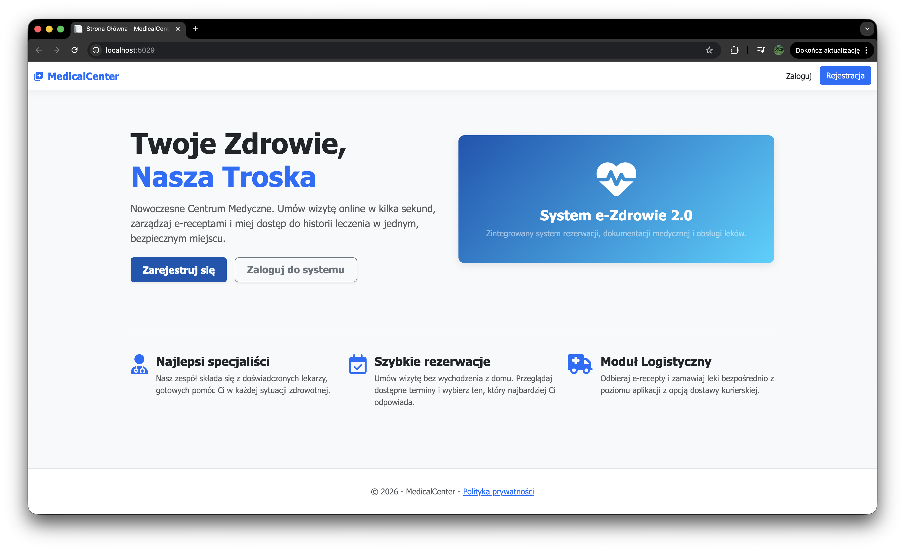
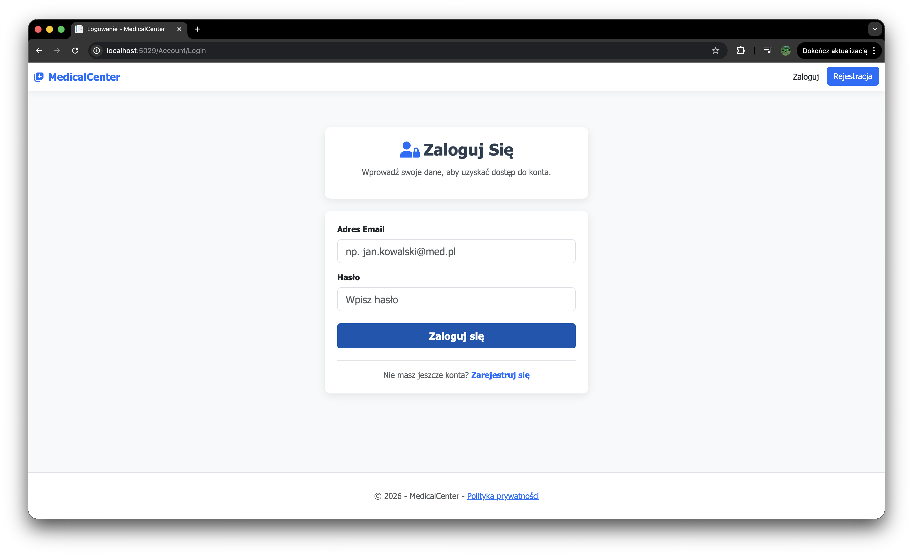
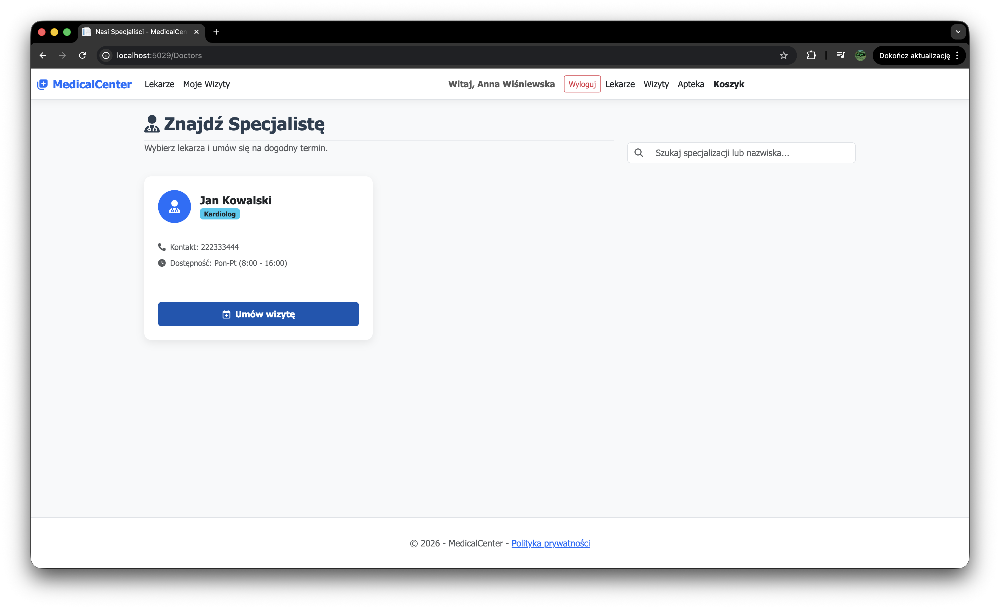
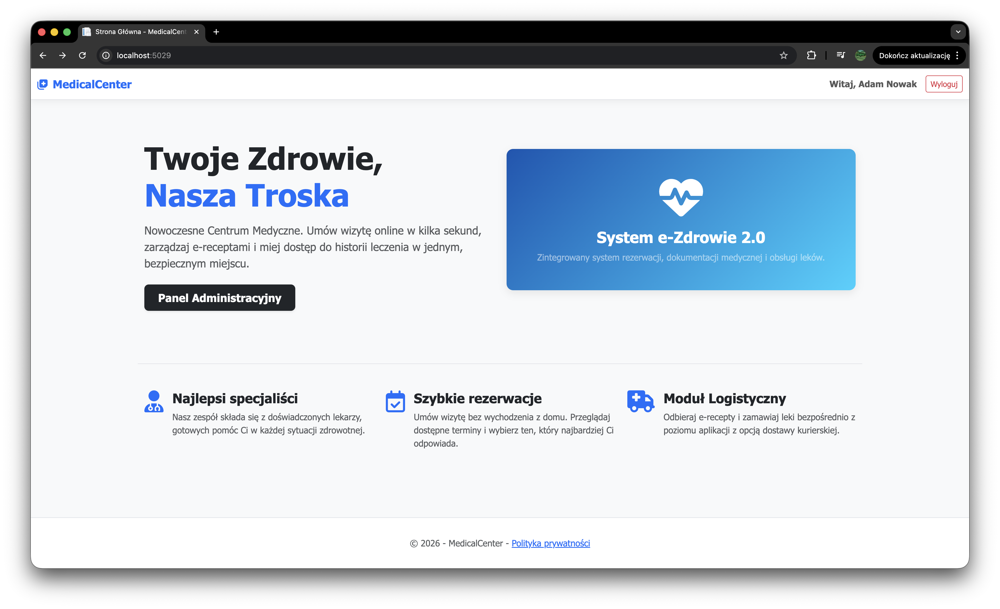

# MedicalCenter
 
Aplikacja webowa centrum medycznego zbudowana w ASP.NET Core MVC z wykorzystaniem Entity Framework Core.
 
## Technologie
 
- **.NET 9.0**
- **ASP.NET Core MVC**
- **Entity Framework Core 9.0** — ORM do obsługi bazy danych
- **SQL Server** — baza danych (LocalDB na Windows, Docker na macOS)
- **BCrypt.Net-Next 4.1.0** — hashowanie haseł
- **Swashbuckle.AspNetCore 10.1.7** — dokumentacja API (Swagger)
- **Bootstrap 5** — framework CSS
## Architektura
 
Aplikacja wykorzystuje architekturę warstwową:
 
```
Controllers → Services → Repositories → Database
```
 
- **Controllers** — obsługa żądań HTTP, zwracanie widoków i odpowiedzi API
- **Services** — logika biznesowa
- **Repositories** — dostęp do bazy danych
- **DTOs** — obiekty transferu danych
## Funkcjonalności
 
### Uwierzytelnianie i autoryzacja
- Rejestracja nowego konta pacjenta
- Logowanie i wylogowanie
- Autoryzacja oparta na rolach (Admin, Doctor, Patient, Courier)
- Sesja oparta na ciasteczkach (Cookie Authentication)
### Panel pacjenta
- Przeglądanie listy lekarzy ze specjalizacjami
- Umawianie wizyt u lekarzy
- Przeglądanie własnych wizyt
- Anulowanie wizyt
### Panel lekarza
- Przeglądanie własnych wizyt
- Przeglądanie listy swoich pacjentów
### Panel admina
- Dodawanie i usuwanie lekarzy
- Przeglądanie listy pacjentów
### API
- Endpointy REST API udokumentowane przez Swagger UI (`/swagger`)
- Pobieranie listy lekarzy
- Pobieranie lekarza po ID


## 🖥️ Demo





- Repository: https://github.com/MajloszIS/MedicalCenter

---

## Instalacja i konfiguracja

## Wymagania
 
- .NET 9.0 SDK
- Git
- Docker Desktop
- IDE: Visual Studio / Rider / VS Code

## Pierwsze uruchomienie

1. Sklonuj repo:
```bash
   git clone 
   cd MedicalCenter
```

2. Postaw bazę w Dockerze:
```bash
   docker compose up -d
```

3. Puść migracje (utworzą tabele i wstawią dane testowe):
```bash
   dotnet ef database update --project MedicalCenter
```

4. Skonfiguruj klucze Stripe (test mode):
```bash
   cd MedicalCenter
   dotnet user-secrets set "Stripe:SecretKey" "sk_test_..."
   dotnet user-secrets set "Stripe:PublishableKey" "pk_test_..."
```
   (Każdy członek zespołu używa własnego konta Stripe — patrz sekcja "Stripe" niżej.)

5. Odpal aplikację:
```bash
   dotnet run --project MedicalCenter
```

6. Otwórz przeglądarkę pod adresem `https://localhost:<port>`


## Codzienna praca

- Start bazy: `docker compose up -d`
- Stop bazy: `docker compose down` (dane zostają)
- Reset bazy od zera: `docker compose down -v && docker compose up -d && dotnet ef database update --project MedicalCenter`


## Stripe (klucze testowe)

Każdy programista używa własnego konta Stripe w trybie testowym.

1. Załóż darmowe konto na https://stripe.com
2. Tryb "Test mode" → https://dashboard.stripe.com/test/apikeys
3. Skopiuj `Secret key` (`sk_test_...`) i `Publishable key` (`pk_test_...`)
4. Wpisz przez `dotnet user-secrets set ...` jak wyżej


---

## Domyślne konta (seed data)
 
| Email | Hasło | Rola |
|-------|-------|------|
| admin@medical.pl | admin123 | Admin |
| doktor@medical.pl | doktor123 | Doctor |
| pacjent@medical.pl | pacjent123 | Patient |
 
## Dokumentacja API
 
Po uruchomieniu aplikacji dokumentacja API dostępna jest pod adresem:
```
https://localhost:<port>/swagger
```
 
## TODO
 
- [ ] Rozbudowa API — więcej endpointów dla wizyt i pacjentów
- [ ] Frontend/CSS — poprawa wyglądu aplikacji
- [ ] Przesyłanie plików — np. zdjęcie profilowe lekarza
- [ ] Zewnętrzne API — np. prognoza pogody
- [ ] Generowanie dokumentów PDF — np. recepta
- [ ] Testy automatyczne — pokrycie głównej logiki aplikacji
- [ ] Wdrożenie na produkcji
